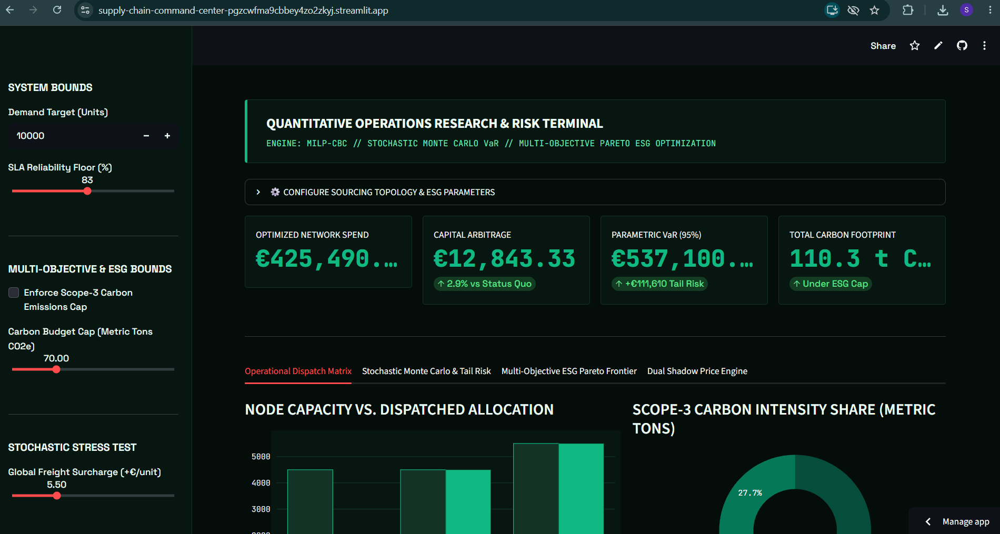
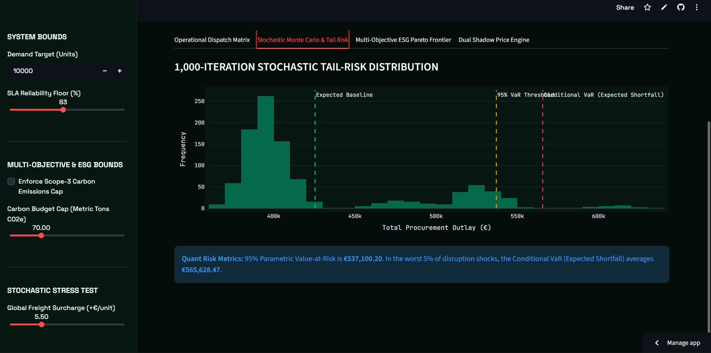
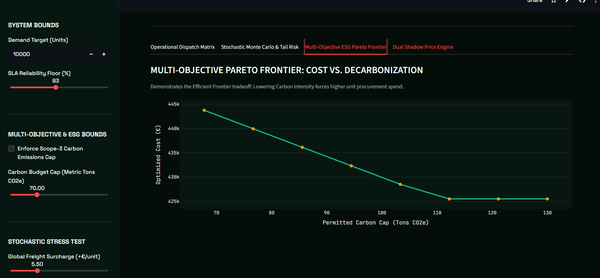
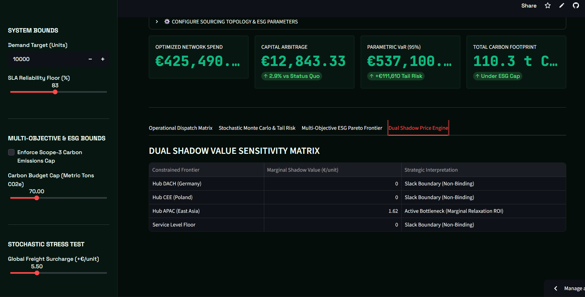

# Autonomous Multi-Tier Sourcing and Disruption Solver

  
 Link to the Dashboard: https://supply-chain-command-center-pgzcwfma9cbbey4zo2zkyj.streamlit.app/

 

An Operations Research (OR) and Prescriptive Analytics platform engineered to solve multi-echelon procurement allocation under capacity limits, freight volatility, contractual Service Level Agreements (SLA), and Scope-3 carbon emission ceilings.

---

## Architecture Overview

Traditional supply chain planning relies on static heuristic distribution or simple linear cost-ranking, which routinely overlooks disruption penalties, capacity bottlenecks, and carbon taxation. 

This platform implements a dual-engine architecture:
* **Deterministic Core:** A Mixed-Integer Linear Programming (MILP) optimization engine that calculates the global minimum-cost dispatch ledger.
* **Stochastic Risk Layer:** A Monte Carlo simulation suite executing 1,000 synthetic disruption cycles to quantify parametric tail risk and structural capital exposure.

###  Prescriptive Executive Decision Engine

  

Unlike passive descriptive dashboards, the engine acts as an autonomous decision system:
* **Automated Action Directives:** Converts complex LP matrix outputs into plain-English procurement orders (**Priority Max-Out**, **SLA Balancing**, or **Zero Allocation / Bypassed**).
* **Eliminates Human Bias:** Replaces naive equal-split ordering with mathematically optimal volume distribution.
* **Bottleneck ROI via Shadow Pricing:** Calculates the exact dollar savings achieved for every single unit of expanded contract capacity ($\pi = \partial \mathcal{L}^* / \partial K_i$).
---

## System Modules

### 1. Operational Dispatch Matrix and Capacity Analysis
Computes optimal unit distribution across fulfillment hubs while respecting individual node capacity ceilings and dynamic demand constraints.

  

 

### 2. Stochastic Tail-Risk Engine (Monte Carlo VaR)
Applies Bernoulli disruption trials and normal freight volatility across 1,000 iterations to evaluate downside operational risk. It generates Parametric Value-at-Risk ($VaR_{95}$) and Conditional Value-at-Risk ($CVaR_{95}$ / Expected Shortfall) to measure extreme loss scenarios.

  

 

### 3. Multi-Objective ESG Pareto Frontier
Implements an $\epsilon$-constraint formulation to plot the convex efficient frontier between landed procurement costs and Scope-3 decarbonization mandates, demonstrating the marginal financial cost per metric ton of carbon avoided.

  

 

### 4. Dual Shadow Price Sensitivity Matrix
Extracts Lagrange multipliers ($\pi = \frac{\partial \mathcal{L}^*}{\partial b_i}$) directly from binding constraint surfaces. This isolates operational bottlenecks and provides procurement leads with the exact economic return per unit of expanded supplier capacity.

  

---

## Mathematical Formulation

### Objective Function
Minimize total landed cost across all sourcing nodes $N$, accounting for sticker price, freight surcharges, and expected unreliability losses:

$$\min_{x} \sum_{i=1}^{N} x_i \cdot \left[ C_{\text{base}, i} + C_{\text{freight}, i} + (1 - R_i) \cdot P_i \right]$$

Where:
* $x_i$: Order quantity allocated to node $i$
* $C_{\text{base}, i}$: Unit purchase cost at node $i$
* $C_{\text{freight}, i}$: Unit logistics and transit cost
* $R_i$: Historical reliability coefficient ($R_i \in [0, 1]$)
* $P_i$: Contractual disruption and emergency expedite penalty

### System Constraints

* **Demand Equilibrium:**
  $$\sum_{i=1}^{N} x_i = D$$

* **Node Capacity Ceilings:**
  $$0 \le x_i \le K_i \quad \forall i \in \{1, \dots, N\}$$

* **Contractual Service Level Floor (SLA):**
  $$\frac{\sum_{i=1}^{N} R_i \cdot x_i}{D} \ge \alpha_{\text{SLA}}$$

* **Scope-3 Carbon Emission Budget:**
  $$\sum_{i=1}^{N} \left( \frac{E_i}{1000} \cdot x_i \right) \le B_{\text{CO}_2}$$

---

## Core Quantitative Metrics

* **Optimized Network Spend:** The global minimum landed cost determined by the branch-and-cut solver.
* **Capital Arbitrage:** Net cash savings generated against a status-quo equal-split baseline across all active nodes.
* **Parametric $VaR_{95}$:** The maximum expected total procurement outlay at the 95th percentile under simulated supply-shock conditions.
* **Conditional $VaR_{95}$ ($CVaR_{95}$):** The expected average procurement outlay in the worst 5% tail disruption scenarios.
* **Marginal Shadow Value ($\pi_i$):** Instantaneous cost reduction achieved per +1 unit relaxation of supplier capacity $K_i$.

---

## Tech Stack

* **Mathematical Optimization:** PuLP (COIN-OR Branch & Cut Solver)
* **Probabilistic & Numerical Computing:** NumPy, Pandas
* **Visual Analytics & UI:** Streamlit, Plotly Graph Objects
