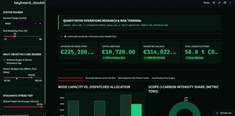

# Autonomous Sourcing & Disruption Solver

  

 

An Operations Research (OR) and Prescriptive Analytics platform built to solve multi-echelon procurement allocation under capacity, freight volatility, service-level (SLA), and Scope-3 carbon constraints.

---

## 📸 System Architecture & Visual Walkthrough

### 1. Operational Dispatch Matrix & Capacity Analysis
Solves the global cost minimum and tracks unit allocation across fulfillment hubs.

  

 

### 2. Stochastic Monte Carlo & Tail-Risk Distribution (VaR)
Simulates 1,000 disruption cycles to calculate Parametric Value-at-Risk ($VaR_{95}$) and Conditional Value-at-Risk ($CVaR_{95}$).

  

 

### 3. Multi-Objective ESG Pareto Efficient Frontier
Maps the mathematical trade-off curve between monetary procurement spend and Scope-3 carbon emission caps.

  

 

### 4. Dual Shadow Pricing & Economic Bottlenecks
Extracts linear programming dual variables ($\pi$) to identify active capacity constraints and calculate marginal returns on contract renegotiation.

  

---

## ⚡ Mathematical Formulation (MILP)

$$\min \sum_{i} x_i \cdot \left[ \text{Base Price}_i + \text{Freight}_i + (1 - \text{Reliability}_i) \cdot \text{Risk Penalty}_i \right]$$

### Constraints:
* **Demand Satisfaction:** $\sum_{i} x_i = D$
* **Capacity Bounds:** $0 \le x_i \le C_i \quad \forall i$
* **Contractual Service Level (SLA):** $\sum_{i} (\text{Reliability}_i \cdot x_i) \ge \text{SLA} \cdot D$
* **Scope-3 Carbon Cap:** $\sum_{i} \left(\frac{\text{Carbon}_i}{1000} \cdot x_i\right) \le \text{Budget}$

---

## 🛠️ Tech Stack
* **Optimization Engine:** PuLP (COIN-OR Branch & Cut)
* **Risk & Analytics:** NumPy, Pandas
* **Visualization & UI:** Streamlit, Plotly Graph Objects
