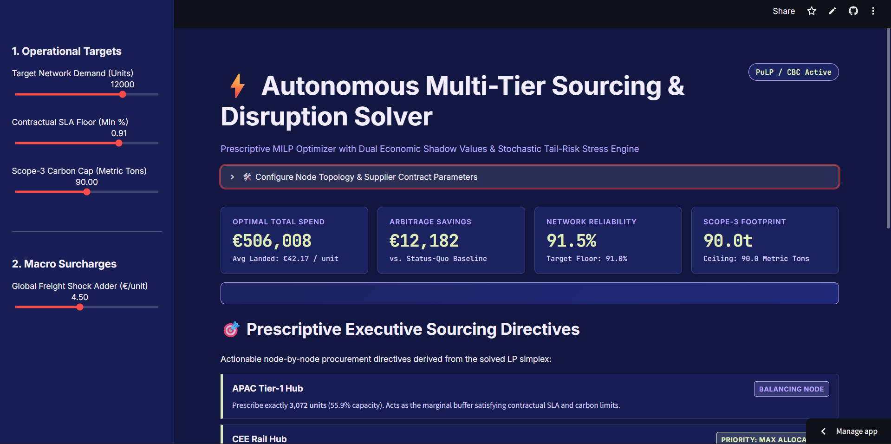
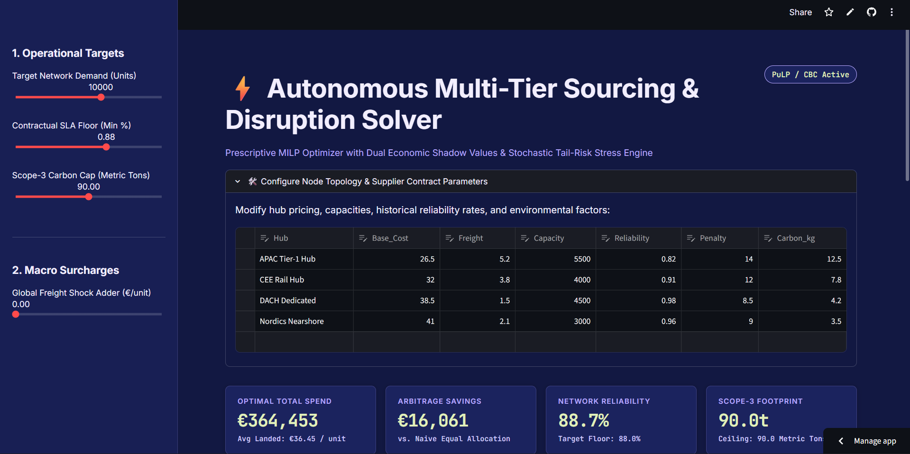
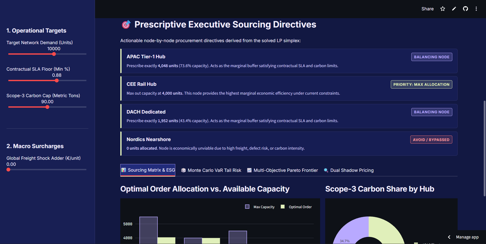

# ⚡ Autonomous Multi-Tier Sourcing & Disruption Solver

[](https://supply-chain-command-center-pgzcwfma9cbbey4zo2zkyj.streamlit.app/)
[](LICENSE)
[](https://www.python.org/)

An enterprise-grade Prescriptive Operations Research platform that formulates a **Mixed-Integer Linear Program (MILP)** to autonomously compute optimal purchase order allocations across global multi-tier supplier hubs. Integrates contractual SLA compliance, Scope-3 carbon ceilings, stochastic Monte Carlo tail-risk simulations ($\text{VaR}_{95} / \text{CVaR}_{95}$), and dual shadow price microeconomics.

---

## 🎬 System Overview & Live Walkthrough

### Executive Terminal & Decision Engine Demo
https://github.com/user-attachments/assets/Dashboard_Preview.mp4

> **Prescriptive Decision Directives:** Converts complex linear programming matrices into clear executive procurement commands (`Priority Max-Out`, `SLA Balancing`, or `Bypassed`) alongside binding bottleneck shadow values ($\pi_i$).

---

## 📸 Platform Previews

### 1. Executive Cockpit & Prescriptive Directives


### 2. Sourcing Matrix & Scope-3 ESG Allocations


### 3. Stochastic Monte Carlo Disruption Engine ($\text{VaR}_{95} / \text{CVaR}_{95}$)


---

## 📌 Executive Architecture & Problem Framing

Traditional supply chain planning relies on descriptive dashboards or heuristic rules of thumb (e.g., naive 33/33/33 splits) that fail to capture the trade-offs between landed unit cost, stochastic disruption penalties, supplier capacities, and sustainability caps.

This system combines:
1. **Mathematical Optimization (PuLP / CBC Solver):** Global cost minimization under strict multi-dimensional constraints.
2. **Prescriptive Action Layer:** Translates raw LP simplex outputs into direct supplier order mandates.
3. **Dual Economic Shadow Pricing ($\pi$):** Quantifies the exact bottom-line return on investment for expanding supplier capacities or relaxing SLAs.
4. **Stochastic Stress Testing (Monte Carlo):** Simulates 1,000 supply disruption scenarios to compute Parametric Value-at-Risk ($\text{VaR}_{95}$) and Conditional Value-at-Risk ($\text{CVaR}_{95}$).
5. **Multi-Objective ESG Pareto Frontier:** Computes the marginal abatement cost curve across stepped carbon caps.

---

## 🧮 Mathematical Formulation

### 1. Objective Function (Total Landed Spend Minimization)
$$\min_{x_i} \sum_{i=1}^{N} x_i \cdot \left[ C_{\text{base}, i} + C_{\text{freight}, i} + (1 - R_i) \cdot P_i \right]$$

Where:
* $x_i \ge 0$: Continuous volume allocated to supplier hub $i$.
* $C_{\text{base}, i}$: Unit base purchase price.
* $C_{\text{freight}, i}$: Unit freight surcharge (including global macroeconomic shock adders).
* $R_i \in [0, 1]$: Historical fulfillment reliability rate.
* $P_i$: Emergency defect / delay recovery penalty per unit.
* $(1 - R_i) \cdot P_i$: Expected disruption risk charge per unit.

### 2. Operational & Environmental Constraints

* **Demand Equilibrium:**
  $$\sum_{i=1}^{N} x_i = D$$
* **Plant Capacity Boundaries:**
  $$0 \le x_i \le K_i \quad \forall i \in \{1, \dots, N\}$$
* **Contractual SLA Reliability Floor:**
  $$\frac{\sum_{i=1}^{N} x_i \cdot R_i}{D} \ge \alpha_{\text{SLA}}$$
* **Scope-3 Carbon Emissions Budget:**
  $$\sum_{i=1}^{N} x_i \cdot \left(\frac{E_i}{1000}\right) \le B_{\text{CO}_2}$$

---

## 🚀 Key Modules

| Module | Engine | Description |
| :--- | :--- | :--- |
| **Prescriptive Directives** | Simplex State Classifier | Classifies nodes into `Priority (100% Max)`, `Balancing (Partial)`, or `Bypassed (0%)` to eliminate human ordering bias. |
| **Dual Shadow Prices** | Lagrangian Multipliers ($\pi_i$) | Identifies binding bottlenecks and calculates the marginal dollar ROI per unit of capacity expansion ($\pi_i = \frac{\partial \mathcal{L}^*}{\partial K_i}$). |
| **Monte Carlo Risk** | Stochastic Engine (1,000 Iterations) | Shocks freight costs $\mathcal{N}(0, \sigma^2)$ and models Bernoulli outage shocks $S_i \sim \text{Bernoulli}(1 - R_i)$ to compute $\text{VaR}_{95}$ and $\text{CVaR}_{95}$. |
| **ESG Pareto Frontier** | $\epsilon$-Constraint Method | Solves across 15 stepped carbon ceilings to map the exact marginal abatement trade-off between procurement cost and carbon emissions. |

---

## 🛠️ Tech Stack

* **Language:** Python 3.10+
* **Linear Programming / MILP:** `PuLP` (COIN-OR CBC Solver)
* **Statistical Simulation:** `NumPy`
* **Data Transformation:** `Pandas`
* **Data Visualization:** `Plotly Graph Objects`, `Plotly Express`
* **Web UI & Deployment:** `Streamlit Cloud`

---

## 📦 Local Installation & Setup

1. **Clone the repository:**
   ```bash
   git clone [https://github.com/shuklasamyak1/supply-chain-command-center.git](https://github.com/shuklasamyak1/supply-chain-command-center.git)
   cd supply-chain-command-center
